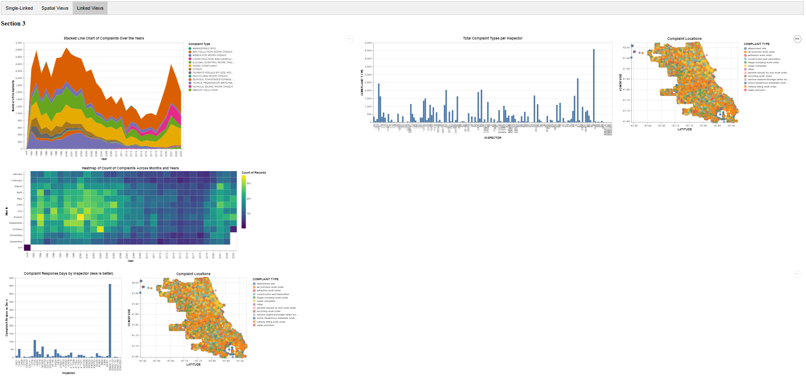

# Link to the visualisation solution:

Link: https://cs424-theboringteam.generic-aws-domain.net/

# Pictures of interface:

*Image 1*:


*Image 2*:


*Image 3*:



# Description:

The provided DataFrame contains information on environmental complaints, which encompass various types, including noise complaints, air pollution work orders, service stations/storage tanks work orders, and more. We also find additional details the inspector assigned, complaint date, and inspection logs. The dataset spans different years, with historical data from the Department of Environment and the Department of Environment. The geographical coordinates (latitude and longitude) and location information are included, offering a comprehensive overview of environmental concerns and their associated details.

# Linked Charts:

1. Linked views between a stacked line and a grid plot:

*Interactions*: Clicking on a complaint type in the stacked area chart reveals its respective count across months against years in the grid chart.

*Question*: Which year had the largest number of complaints for air pollution work orders, alongside the largest ratio for said complaint type? And which year had the lowest? \
*Insights*: 2000 had the most number of complaints whilst 2015 had the least number of complaints, which corresponds directly to the ratio of the complaint type with other complaint types too.

 \
*Caption: Complaints over the years -> Complaints across months and years*

2. Linked views between a histogram and a choropleth:

*Interactions*: Clicking on a bar representing the number of complaints handled by different inspectors displays a scatter plot illustrating the types of complaints they managed in relation to the location where they occurred.

*Question*: Which inspectors are the best performers, and what types of complaints do they typically handle in specific areas of Chicago? \
*Insights*: Inspector 9 handled the highest number of air pollution complaints in the northern regions of Chicago.

 \
*Caption: Total complaints per inspector -> Complaint type, Locations*

3. Linked views between a histogram and a scatter plot:

*Interactions*: Clicking on a bar indicating the duration within which an inspector made changes to the status of a complaint reveals a scatter plot showcasing the types of complaints in relation to their respective locations.

*Question*: Which inspector is the least active, and what types of complaints does he/she handle in which areas of Chicago? \
*Insights*: Inspector eno00114 is the least active, handling only 2 complaints in the southern parts of Chicago.

 \
*Caption: Complaint response by inspector -> Complaint locations*

4. Linked views between a line chart and a stacked bar:

*Interactions*: Clicking on a line representing the number of complaints handled by each department provides insights into the distribution of complaints across different departments.

*Question*: How does the complaints handling trend differ across departments, and what types of complaints are handled more? \
*Insights*: We can observe that the Historic Department of Environment consistently handles more complaints than the Department of Public Health until approximately 9 years. The most common type of complaints handled is air pollution.

 \
*Caption: Complaints over time by the two departments -> Count of complaint types*

5. Linked views between a pie chart and a horizontal bar chart:

*Interactions*: Clicking on a pie chart segment corresponding to directions (East-West-North-South) reveals a bar chart displaying the community in which the complaints occurred relative to the number of records.

*Question*: In which community are there fewer complaints in the direction where the recorded complaints are 17098? \
*Insights*: The direction with 17098 recorded complaints is South, and the community with fewer complaints in that direction is Loop.

 \
*Caption: Complaints by direction -> Complaints by community*

6. Linked views between a pie chart and a scatter plot:

*Interactions*: Selecting a pie segment (i.e., street type) in the pie chart displays a scatter plot depicting the types of complaints in relation to the street type.

*Question*: Provide the latitude and longitude of the occurrence of the major number of air pollution work order complaints in the street type with 320 complaints.
*Insights*: From the pie chart, we can identify that the street type is HWY, which has a complaint count of 320. The location of occurrence of air pollution work order complaints is approximately (-87.88, 41.96) to (-87.83, 42.00).

 \
*Caption: Complaints by street type -> Complaint locations*

7. Linked views between a scatter plot and a pie chart:

*Interactions*: Clicking on a point in the scatter plot, which indicates the community of Chicago in relation to latitude and longitude, reveals a pie chart showcasing the types of complaints that occurred in that community along with their counts when hovered over.

*Question*: What are the proportions of complaints in the different communities of Chicago? \
*Insights*: We can observe that for the O'Hare community, the majority of complaints are of the type toxic hazardous materials work order.

 \
*Captions: Scatter plots of complaints by location -> Pie charts of complaint types*

8. Linked views between a stacked bar chart and a scatter plot:

*Interactions*: Clicking on a bar representing an inspector who handled a higher number of a particular type of complaint reveals a scatter plot showing the location, year-wise count, and inspector details when hovering over a point.

*Question*: Can we determine which inspector handled the highest number of complaints, particularly considering that Inspector 9 managed the most complaints in 1997 in West Town?
*Insights*: We can observe that Inspector 9 handled the highest number of complaints, specifically in the year 1997 in West Town.

 \
*Captions: Top 10 inspectors for complaints -> Inspector complaints by year*

9. Linked views between a donut and a bar chart:

*Interactions*: Clicking on a section (i.e., month) of the radial chart, sectioned based on the number of complaints in the year 2000, reveals a bar chart illustrating the types of complaints and their counts for that specific month.

*Question*: Which type of complaint had the fewest number of reports in a month of the year 2000, considering that the total number of complaints for that month was 241? \
*Insights*: The radial chart indicates that the month with the specified number of 241 complaints is May (month number 5). Further analysis reveals that the complaint type with the least number of reports in May 2000 is 'recycling work order.'

 \
*Captions:Complaints by month for the year 2000 -> Complaint type by month*

## Essential transformations:

```
# Data Reading and Cleaning
file_path = 'CDPH_Environmental_Complaints.csv'
complaints_df = pd.read_csv(file_path)
complaints_df['COMPLAINT TYPE'] = complaints_df['COMPLAINT TYPE'].str.lower()

chicago_geojson = "Communities-Chicago.geojson"
chicago_gdf = gpd.read_file(chicago_geojson)

# Spatial Operations
inspector_gdf = gpd.sjoin(inspector_gdf, chicago_gdf, op='within').drop(columns=['LOCATION', 'index_right'])

# Grouping and Aggregation
complaint_type_counts = inspector_gdf.groupby('INSPECTOR')['COMPLAINT TYPE'].count().reset_index()

street_df = complaints_df[['STREET TYPE', 'COMPLAINT TYPE', 'LOCATION']]
street_df['LATITUDE'] = street_df['LOCATION'].apply(lambda x: float(x.split()[1][1:]))
street_df['LONGITUDE'] = street_df['LOCATION'].apply(lambda x: float(x.split()[2][:-1]))
street_df['geometry'] = street_df.apply(lambda row: Point(row['LATITUDE'], row['LONGITUDE']), axis=1)
street_gdf = gpd.GeoDataFrame(street_df, geometry='geometry')
chicago_street_gdf = gpd.sjoin(street_gdf, chicago_gdf, op='within').drop(columns=['LOCATION', 'index_right'])
street_type_counts = chicago_street_gdf.groupby('STREET TYPE')['COMPLAINT TYPE'].count().reset_index()

# Departmental Analysis
month_df = complaints_df[['COMPLAINT ID', 'COMPLAINT DATE', 'COMPLAINT TYPE']]
month_df['COMPLAINT DATE'] = pd.to_datetime(month_df['COMPLAINT DATE'])
month_df['Year'] = month_df['COMPLAINT DATE'].dt.year
monthly_complaint_counts = month_df[month_df['Year'] == 2000].groupby('Month')['COMPLAINT TYPE'].count().reset_index()

# Geospatial Analysis
complaints_df['COMPLAINT TYPE'] = complaints_df['COMPLAINT TYPE'].str.lower()
complaints_df['COMPLAINT DATE'] = pd.to_datetime(complaints_df['COMPLAINT DATE'])
complaints_df.dropna(subset=['COMPLAINT DATE'], inplace=True)
complaints_df['COMPLAINT YEAR'] = complaints_df['COMPLAINT DATE'].dt.year
complaints_df['LATITUDE'] = complaints_df['LOCATION'].str.extract(r'POINT \((.*?) (.*?)\)')[1].astype(float)
complaints_df['LONGITUDE'] = complaints_df['LOCATION'].str.extract(r'POINT \((.*?) (.*?)\)')[0].astype(float)

communities_gdf = gpd.read_file(chicago_geojson)
geometry = [Point(xy) for xy in zip(complaints_df['LONGITUDE'], complaints_df['LATITUDE'])]
complaints_gdf = gpd.GeoDataFrame(complaints_df, geometry=geometry)
complaints_with_neighborhood = gpd.sjoin(complaints_gdf, communities_gdf, how='left', op='within')
complaints_df = complaints_with_neighborhood[['COMPLAINT TYPE', 'COMPLAINT YEAR', 'LATITUDE', 'LONGITUDE', 'area_num_1', 'INSPECTOR']]

# Centroid Calculation
centroids = communities_gdf['geometry'].centroid
communities_gdf['latitude_centroid'] = centroids.y
communities_gdf['longitude_centroid'] = centroids.x
communities_gdf = communities_gdf[['area_num_1', 'community', 'latitude_centroid', 'longitude_centroid']]
```

# Single-view charts:

1. Single view from a spider chart:

*Question*: Compare the performance of two inspectors. \
*Insights*: It is evident that Inspector 9 outperforms Inspector 55 across all complaint types.

 \
*Caption: Complaints by Inspector*

2. Single view from waterfall chart:

*Question*: How does a department perform annually? \
*Insight*: We can observe a decremental performance trend for the department from 2001 to 2008.

 \
*Caption*: Waterfall chart depicting the decline in complaints across years for a department.

3. Single view from a bi-directional bar plot:

*Question*: compare the performance of the 2 department \
*Insight*: We can observe that the historic department performed better than the department of Public Health for all the years

 \
*Caption: number of complaints for the 2 departments*

4. Single view from a pie chart:

*Question*: which street type has the most number of complaints? \
*Insight*: we can observe that Avenue Street have the most number of complaints

 \
*Caption: complaint by street type*

5. Single view from a grid chart:

*Question*: How does the complaint count vary across months? \
*Insight*: We can observe that the highest number of complaints were registered in the year 2000.

 \
*Caption: Heatmap depicting the count of complaints across months and years.*

6. Single view from a stacked line chart:

*Question*: During which years does the complete count peak and which types contribute towards it? \
*Insights*: We can observe that air pollution forms the majority of the communities during the peaks observed during 1998 and 2022

 \
*Caption: Stacked area chart of complaints over the years*

7. Single view from a histogram:

*Question*: Which inspectors registered the highest number of complaints? \
*Insights*: We can observe that agent 47 handled the highest number of complaints

 \
*Caption: Histogram of number of complaints by inspector*

## Essential transformations:

```
import pandas as pd

# Read data and convert 'COMPLAINT TYPE' to uppercase
complaints_df = pd.read_csv('CDPH_Environmental_Complaints.csv')
complaints_df['COMPLAINT TYPE'] = complaints_df['COMPLAINT TYPE'].str.upper()

# Inspector complaints analysis
inspector_filtered_df = complaints_df[['INSPECTOR', 'COMPLAINT TYPE']].rename(columns={'COMPLAINT TYPE': 'COMPLAINT_TYPE'})
inspector_filtered_df['COMPLAINT_TYPE'] = inspector_filtered_df['COMPLAINT_TYPE'].str.replace(' ', '_', regex=False)
grouped = inspector_filtered_df[inspector_filtered_df['INSPECTOR'].isin(['55', '9'])].groupby(['INSPECTOR', 'COMPLAINT_TYPE']).size().reset_index(name='COUNT')
top5_complaints_per_inspector = grouped.sort_values(by=['INSPECTOR', 'COUNT'], ascending=[True, False]).groupby('INSPECTOR').head(5)

# Complaints by year analysis
complaints_by_year = complaints_df[['COMPLAINT ID', 'COMPLAINT DATE']]
complaints_by_year['COMPLAINT DATE'] = pd.to_datetime(complaints_by_year['COMPLAINT DATE'])
complaints_by_year['YEAR'] = complaints_by_year['COMPLAINT DATE'].dt.year
complaints_by_year = complaints_by_year['YEAR'].value_counts().reset_index().sort_values(by='index').rename(columns={'index': 'YEAR', 'YEAR': 'COMPLAINT COUNT'})
complaints_by_year = pd.concat([pd.Series(["Begin", complaints_by_year.iloc[0]['COMPLAINT COUNT']], index=['YEAR', 'COMPLAINT COUNT']),
                                complaints_by_year,
                                pd.Series(["End", complaints_by_year.iloc[-1]['COMPLAINT COUNT']], index=['YEAR', 'COMPLAINT COUNT'])],
                               ignore_index=True)
complaints_by_year['COUNT_CHANGE'] = complaints_by_year['COMPLAINT COUNT'].diff()
complaints_by_year.at[0, 'COUNT_CHANGE'] = complaints_by_year.at[0, 'COMPLAINT COUNT']
complaints_by_year.at[len(complaints_by_year) - 1, 'COUNT_CHANGE'] = complaints_by_year.at[len(complaints_by_year) - 1, 'COMPLAINT COUNT']

# Complaints by data source analysis
filtered_complaints = complaints_df[['COMPLAINT ID', 'DATA SOURCE', 'COMPLAINT DATE']].sort_values(by=['DATA SOURCE', 'COMPLAINT DATE']).dropna(subset=['COMPLAINT DATE'])
filtered_complaints['COMPLAINT DATE'] = pd.to_datetime(filtered_complaints['COMPLAINT DATE'])
filtered_complaints = filtered_complaints.groupby('DATA SOURCE').head(1).reset_index(drop=True)
filtered_complaints['YEAR_ORDER'] = filtered_complaints.groupby('DATA SOURCE').cumcount() + 1

# Street type analysis
street_type_complaint_counts = complaints_df[["COMPLAINT TYPE", "COMPLAINT ID", "STREET TYPE"]].groupby("STREET TYPE")["COMPLAINT TYPE"].count().reset_index().rename(columns={"COMPLAINT TYPE": "NUMBER OF COMPLAINTS"}).sort_values(by="NUMBER OF COMPLAINTS", ascending=False).head(5)

# Monthly complaints analysis
monthly_complaints = complaints_df[["COMPLAINT ID", "COMPLAINT DATE"]].rename(columns={"COMPLAINT DATE": "Month"}).set_index("Month").resample("M").count().reset_index()
monthly_complaints[['Year', 'Month']] = monthly_complaints['Month'].dt.strftime('%Y-%m').str.split('-', expand=True)
yearly_monthly_counts = monthly_complaints.groupby(["Year", "Month"]).sum().reset_index().rename(columns={"COMPLAINT ID": "Count"})
```

# Spatial charts:

1. Spatial view for the distribution of complaints across Chicago:

*Question*: How are the complaints types distributed across Chicago? \
*Insights*: We can observe that mote water pollution complaints are observed in the northern side of chicago and the abandoned site complaints are sparsely populated across chicago

 \
*Caption: Distribution of complaint types across chicago*

2. Spatial view for the distribution of complaints across decades in Chicago:

*Question*: How are the complaints types distributed across decades? \
*Insights*: We can observe that construction and demolition complaints increased drastically in the 3rd decade

 \
*Caption: Distribution of complaint types across decades*

3. Spatial view for the total number of complaints in a community:

*Question*: who are the complaints distributed by the community? \
*Insights*: we can observe that the downtown community has the highest number of complaints 

 \
*Caption: complaints by community* 

## Essential transformations:

```
# Load GeoJSON and set CRS
communities_gdf = gpd.read_file('Communities-Chicago.geojson')
communities_gdf.crs = "EPSG:4326"

# Merge polygons into a single polygon for Chicago
chicago_gdf = gpd.GeoDataFrame(geometry=[communities_gdf.unary_union])

# Load and preprocess complaints data
complaints_df = pd.read_csv('CDPH_Environmental_Complaints.csv')
complaints_df['LATITUDE'] = complaints_df['LOCATION'].str.extract(r'POINT \((.*?) (.*?)\)').astype(float)
complaints_df['LONGITUDE'] = complaints_df['LOCATION'].str.extract(r'POINT \((.*?) (.*?)\)')[0].astype(float)
complaints_df['COMPLAINT TYPE'] = complaints_df['COMPLAINT TYPE'].str.lower()
complaints_df['COMPLAINT DATE'] = pd.to_datetime(complaints_df['COMPLAINT DATE'])
complaints_df.dropna(subset=['COMPLAINT DATE'], inplace=True)

# Function to categorize decades
def categorize_decade(year):
    return 1 if 1992 <= year <= 2003 else (2 if 2003 < year <= 2013 else 3)

complaints_df['DECADE'] = complaints_df['COMPLAINT DATE'].dt.year.apply(categorize_decade)

# Create GeoDataFrame with complaints
complaints_gdf = gpd.GeoDataFrame(complaints_df[['COMPLAINT TYPE', 'LATITUDE', 'LONGITUDE', 'DECADE']],
                                  geometry=gpd.points_from_xy(complaints_df['LONGITUDE'], complaints_df['LATITUDE']),
                                  crs='EPSG:4326')

# Filter points within Chicago
chicago_complaints_gdf = gpd.sjoin(complaints_gdf, chicago_gdf, how='right', op='within').drop(columns=['index_left', 'geometry'])

# Calculate complaint counts for each community
grouped_grid_tricount_gdf = gpd.sjoin(complaints_gdf, communities_gdf, how='right', op='within')\
    .groupby(['area_num_1', 'community']).agg({'geometry': 'first', 'COMPLAINT TYPE': 'count'}).reset_index()

# Rename columns for clarity
grouped_grid_tricount_gdf.columns = ['area_num_1', 'community', 'geometry', 'Total_Complaint_Types']
grouped_grid_tricount_gdf = grouped_grid_tricount_gdf.set_geometry('geometry')
```